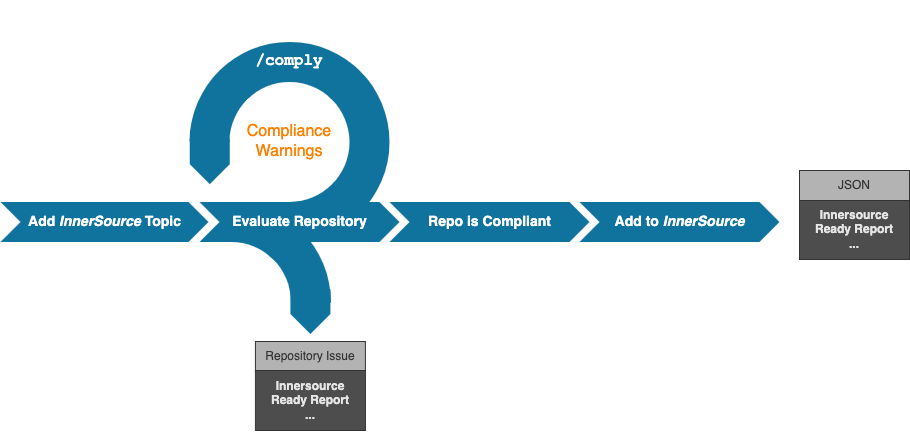
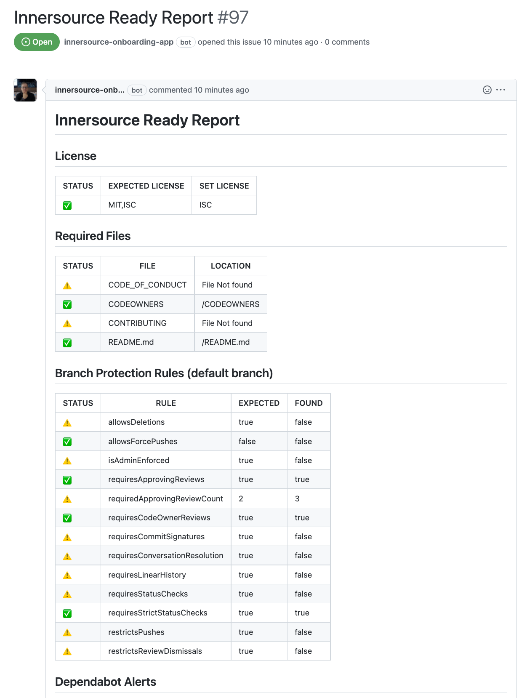
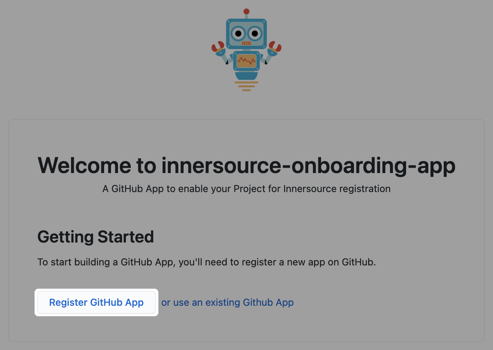

# innersource-onboarding-app

A GitHub App to enable your Project for Innersource registration.

The App evaluates a Repo that is 'marked' for InnerSourcing, to be compliant with configured requirements.

The App creates an `InnerSource Ready Report` within the Repo, listing all required Repo settings and their compliance.

In case a Repo is not compliant, the user can *'fix'* the required settings and re-run the compliance check (Issue-Ops Comment: `/check`).

When all InnerSource requirements are met, the App sends the `InnerSource Ready Report` to a InnerSource registration service.

## Process Flow to *InnerSource* a Repo



## Sample Issue Report



---

## Quickstart

### Install the App (Development)

```bash
npm install
```

```bash
npm run dev
```

<details><summary>Click for a result sample</summary>

```bash
> innersource-onboarding-app@1.0.0 dev
> nodemon --exec "npm start"

[nodemon] 2.0.4
[nodemon] to restart at any time, enter `rs`
[nodemon] watching path(s): *.*
[nodemon] watching extensions: js,mjs,json
[nodemon] starting `npm start`

> innersource-onboarding-app@1.0.0 start
> probot run ./src/index.js

INFO (probot): 
INFO (probot): Welcome to Probot!
INFO (probot): Probot is in setup mode, webhooks cannot be received and
INFO (probot): custom routes will not work until APP_ID and PRIVATE_KEY
INFO (probot): are configured in .env.
INFO (probot): Please follow the instructions at http://localhost:3000 to configure .env.
INFO (probot): Once you are done, restart the server.
INFO (probot): 
INFO (server): Running Probot v12.2.8 (Node.js: v18.8.0)
INFO (server): Listening on http://localhost:3000
```

</details>

#### Register the App

- Open the Website `http://localhost:3000/probot` and click `Register GitHub App`.

    

- Follow the GitHub App registration steps.
    - This will create and populate a local `.env` file.

- After the completion of the App registration, restart the App.

    <details><summary>Click for a result sample</summary>

    ```bash
    > innersource-onboarding-app@1.0.0 dev
    > nodemon --exec "npm start"

    [nodemon] 2.0.4
    [nodemon] to restart at any time, enter `rs`
    [nodemon] watching path(s): *.*
    [nodemon] watching extensions: js,mjs,json
    [nodemon] starting `npm start`

    > innersource-onboarding-app@1.0.0 start
    > probot run ./src/index.js

    INFO (probot): Yay, the app was loaded!
    INFO (probot): Loading App Config file
    INFO (server): Running Probot v12.2.8 (Node.js: v18.8.0)
    INFO (server): Forwarding https://smee.io/iN1tiq9QDrR9sr to http://localhost:3000/
    INFO (server): Listening on http://localhost:3000
    INFO (server): Connected
    ```

    </details>
- Done !
